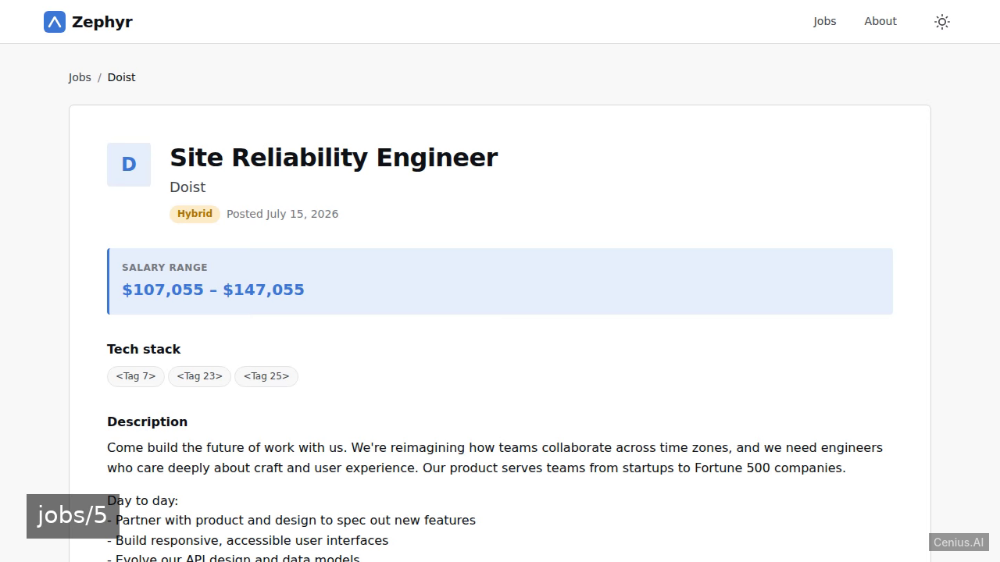
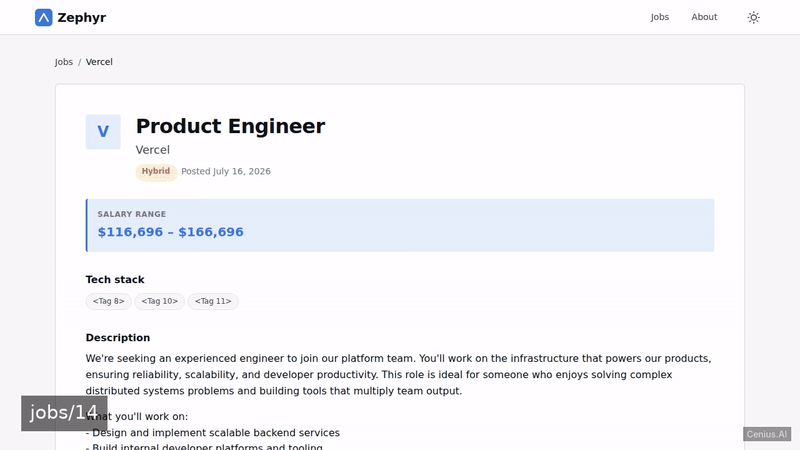
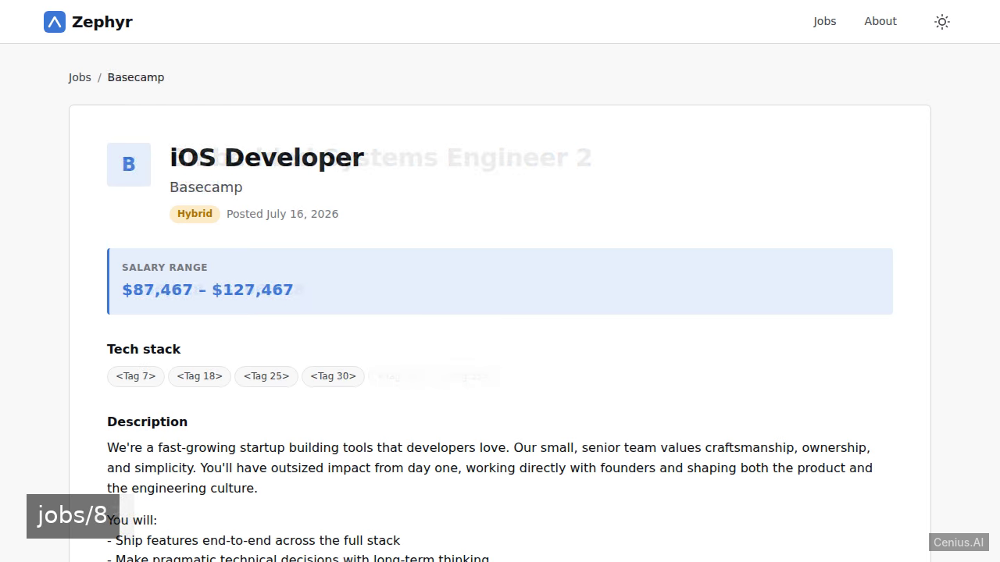
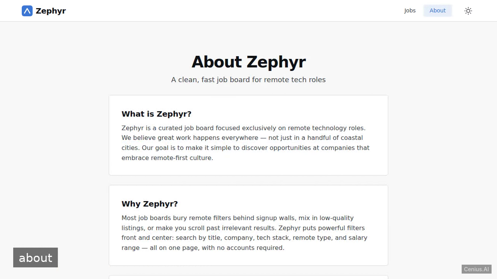

# Zephyr Remote Job Board — production-ready Flask search engine app starter

Need a self-hosted search engine app? **Zephyr Remote Job Board** is the open-source answer: a Flask project you can clone, run, and own. Build a Flask web application for browsing remote tech jobs with powerful filtering (by title, company, tech stack, remote type, salary range). Every Zephyr Remote Job Board line of code is here — no stripped demo, no paywalled features. Apache-2.0-licensed; [remix Zephyr Remote Job Board on cenius.ai](https://cenius.ai/marketplace/p/zephyr-remote-job-board?ref=gh&utm_campaign=zephyr-remote-job-board-flask) for a bespoke custom version.


[](LICENSE)  [](https://cenius.ai)

[](https://cenius.ai/marketplace/p/zephyr-remote-job-board?ref=gh&utm_campaign=zephyr-remote-job-board-flask)

> **▶ [Open & edit in cenius.ai](https://cenius.ai/marketplace/p/zephyr-remote-job-board?ref=gh&utm_campaign=zephyr-remote-job-board-flask)** — one click to an editable workspace: describe changes in plain English, get an instant preview, one-click deploy and host. Modifications made on the platform come with full rebrand & relicense rights.

_Local clone? See [Quick start](#quick-start) below. cenius.ai is the zero-setup path._

## Demo





📽 **[Watch the walkthrough](https://cenius.ai/marketplace/p/zephyr-remote-job-board?ref=gh&utm_campaign=zephyr-remote-job-board-flask)** — plays on cenius.ai · [MP4 file](.github/media/demo.mp4)

## Screenshots

  

## Quick start

```bash
./install.sh   # installs dependencies + seeds demo data
```

See [`INSTALL.md`](INSTALL.md) for full setup and usage instructions.

## Usage guide

Once the development server is running (default: `http://localhost:5000`), you can use the job board through a web browser or by sending HTTP requests.

### Web Interface

#### Home — Job Listing (`/`)

- Shows paginated remote tech jobs (12 per page).
- **Filters**: Use the search form to narrow results by:
  - `title` – keyword in job title
  - `company` – company name (select from dropdown)
  - `tech_stack` – desired technology (select from available tags)
  - `remote_type` – e.g., "Remote", "Hybrid"
  - `salary_min` / `salary_max` – integer values
- Click any job title to view its details.

#### Job Detail (`/jobs/<id>`)

Displays full information about a single job: company, location, remote type, salary, description, and associated tech tags.

#### About (`/about`)

Provides a short description of the Zephyr project.

#### Hello (`/hello`)

A minimal health‑check / sanity route that returns the text `Hello`.

### JSON API

All API endpoints are prefixed with `/api` and return JSON.

#### List Jobs – `GET /api/jobs`

Accepts the same query parameters as the web home page plus `page` and `per_page` (max 50).

**Example**:

```bash
curl "http://localhost:5000/api/jobs?title=python&remote_type=Remote&page=1"
```

Response contains `jobs`, `page`, `per_page`, `total`, `pages`.

#### Single Job – `GET /api/jobs/<id>`

```bash
curl http://localhost:5000/api/jobs/1
```

Returns the job object with its tags, or a 404 error if not found.

#### List Companies – `GET /api/companies`

```bash
curl http://localhost:5000/api/companies
```

_Full guide: [`USAGE.md`](USAGE.md)_

## Features

- Job listing with filters
- Job detail page
- Seeded demo data
- Responsive and modern UI with light/dark mode
- About page

## Architecture

Everything runs out of the box: a Flask codebase (28 files). `install.sh` takes care of packages and initial data in a single pass; nothing else is required before launching. Top-level layout: `instance/`, `routes/`, `services/`, `static/`, `templates/`. Installation walkthrough: [`INSTALL.md`](INSTALL.md).

## FAQ

### How do I self-host Zephyr Remote Job Board?

Everything you need ships in this repo: clone it, run `./install.sh` to install dependencies and seed demo data, then follow [`INSTALL.md`](INSTALL.md) to start it. No external services required.

### Is white-labeling Zephyr Remote Job Board allowed?

Yes. The MIT license lets you remove the original branding and ship under your own name. For a guided approach, [remix it on cenius.ai](https://cenius.ai/marketplace/p/zephyr-remote-job-board?ref=gh&utm_campaign=zephyr-remote-job-board-flask): you get a fresh build with full rebrand and relicense rights.

### What powers Zephyr Remote Job Board under the hood?

The app is built with Flask. What you see in this repo is the full production source, demo data included. Highlights include responsive and modern UI with light/dark mode.

### Is there a no-code way to modify Zephyr Remote Job Board?

Open it on [cenius.ai](https://cenius.ai/marketplace/p/zephyr-remote-job-board?ref=gh&utm_campaign=zephyr-remote-job-board-flask) and describe the changes you want in plain English — the platform modifies the app and gives you a new, downloadable build.

### Can I build a business on Zephyr Remote Job Board?

Confirmed free for commercial use — MIT terms let you incorporate, resell, or ship it in any product. [LICENSE](LICENSE).

## License & rebranding

Released under the [Apache License 2.0](LICENSE) (© 2026 Cenius AI) — free for personal and commercial use. The Cenius name/logo are trademarks (see NOTICE).

**Need a customized version?** [Remix this app on cenius.ai](https://cenius.ai/marketplace/p/zephyr-remote-job-board?ref=gh&utm_campaign=zephyr-remote-job-board-flask) — modifications made on the platform come with **full rebrand & relicense rights** over your derivative.

## Built with cenius.ai

This entire application — code, design, seeded demo data — was generated on **[cenius.ai](https://cenius.ai)** from a plain-English description.

- 🚀 [Build your own app on cenius.ai](https://cenius.ai)
- 🎛️ [Remix Zephyr Remote Job Board on the marketplace](https://cenius.ai/marketplace/p/zephyr-remote-job-board?ref=gh&utm_campaign=zephyr-remote-job-board-flask) — open it in a workspace, prompt for changes, and ship your own version.

More open-source apps: [the Cenius-ai catalog](https://github.com/Cenius-ai) · [showcase index](https://github.com/Cenius-ai/showcase)
